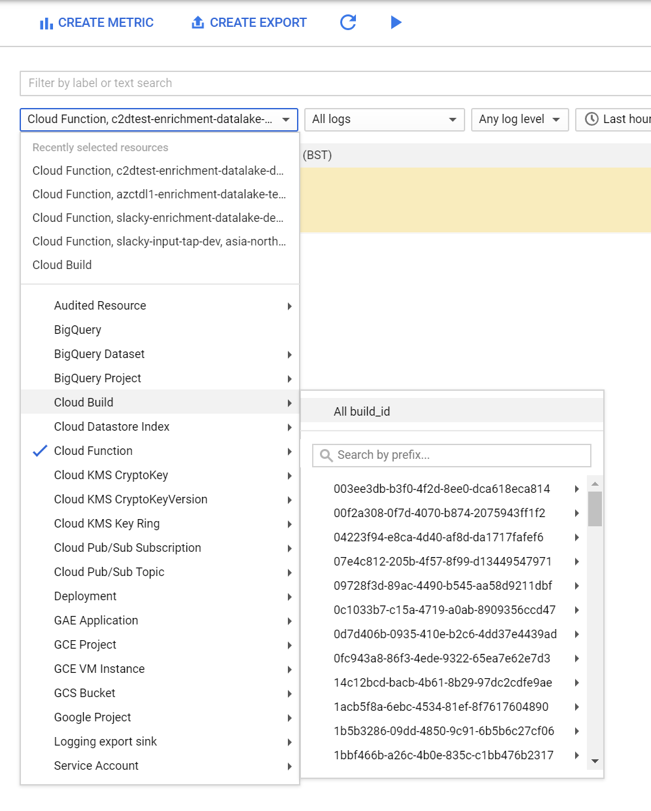
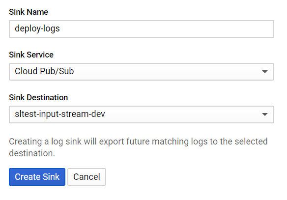
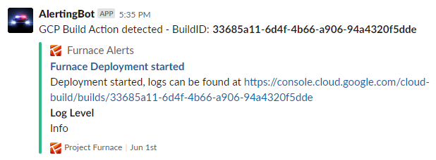

# GCP Stack Deploy Monitor

A sample stack to monitor the state of Furnace Deployments and send notifications to Slack when a deployment is either Started, Successfully Completed, or Failed.

### Sources
- Cloud Build Logs

### Sinks
- Firestore

### Modules
- builder-tap
- slackbot-alerter
- tablesink

---

## Installation

### Prerequisites

1. An ignited furnace running on Google Cloud Platform.  Follow the [Getting Started Guide](https://docs.furnace.org/core/basics/getting-started) if you don't already have one.
2. An [incoming webhook url](https://get.slack.help/hc/en-gb/articles/115005265063-Incoming-webhooks-for-Slack) for Slack

### Main Install

1. Run `furnace new {stackname}` to create a new stack eg `furnace new deploy-monitor`
2. Clone this repository `git clone https://github.com/ProjectFurnace/playground.git`
3. Copy the files in the `gcp-stack-deploy-monitor` over to your new stack `cp -r playground/gcp-stack-deploy-monitor/* deploy-monitor/`
4. Modify the `config.yaml` file in the `modules\slackbot-alerter` and add your Slack webhook url to the `default` parameter in the config.
5. Add the files to git `git add .`
6. Commit the new files `git commit -am 'Initial commit'`
7. Push the files to your git repo `git push origin master`

### Hooking up the logs

Once the stack has built you need to go into GCP and create an export of the Build Logs and send it to the Source of your stack

1. Visit the [Stackdriver Logging](https://console.cloud.google.com/logs/exports) and create a new export

2. Enter a `Sink Name` for the export something like `deploy-logs`
3. For the `Sink Service` Select `Cloud Pub/Sub`
4. For the `Sink Destination` select your input stream eg `deploy-monitor-input-stream-dev`
5. Create the sink.

### Testing

When you push any stack up for deployment you should now get a Slack notification with a link to the build logs. 

